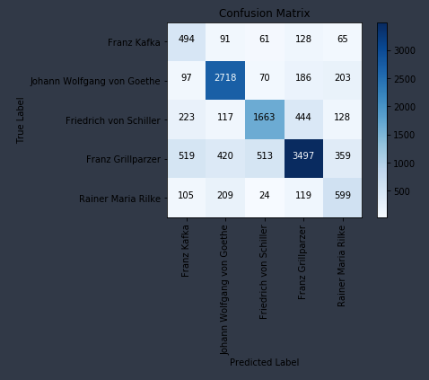

# deutsch-nlp

## Overview
I took five german authors from the Kaggle German Literature dataset.  Using a Multinomial Naive Bayes classifier with TF-IDF vectorization, I built a pipeline that takes in German text and produces a prediction.

## Resources
- Korpus: https://www.kaggle.com/jihyeseo/german-literature-from-digbiborg
- Stopwords: https://github.com/stopwords-iso/stopwords-de
- Other resources:
  - https://medium.com/idealo-tech-blog/common-pitfalls-with-the-preprocessing-of-german-text-for-nlp-3cfb8dc19ebe
  - https://medium.com/syncedreview/applying-multinomial-naive-bayes-to-nlp-problems-a-practical-explanation-4f5271768ebf
- NER and POS Tagging for MNB: https://towardsdatascience.com/named-entity-recognition-and-classification-with-scikit-learn-f05372f07ba2
- Translation  API: https://tech.yandex.com/translate/

## To Do
- add translation API to pipeline
- improve recall for Kafka texts
